<p align="left">
  
</p>
DeFilms is a SwiftUI movie discovery app built with the TMDB API. It was developed as an iOS case study, but I approached it like a small product rather than a one-off demo: stable navigation, testable state, careful persistence, polished localization, and a user flow that holds together across edge cases.

The app is organized around three tabs:
- Movies
- Favorites
- Settings

## What’s Included

### Movies
- Search with validation and recent search history
- Filter and sort controls for year, rating, genre, and ordering
- Rich detail pages with trailer, cast, watch providers, gallery, and similar titles
- Multiple browse sections such as trending, popular, now playing, upcoming, and top rated

### Favorites
- Multiple custom favorite lists instead of a single flat “saved” bucket
- Create, rename, delete, move, and remove flows
- Confirmation steps for destructive actions
- Movie management flows that support both moving and removing without forcing unnecessary list creation

### Settings
- Light / dark theme selection
- English, Turkish, and Arabic localization
- RTL-aware layout handling for Arabic
- Local sign up, sign in, sign out, and password change flows
- App version display and session persistence

## A Few Product Decisions

Some choices were intentional because they make the app feel more complete than a typical study-case implementation:

- Favorites are list-based. People usually think in collections like “Watch This Weekend” or “Sci-Fi”, not in a single generic saved pool.
- Search history is stored locally and kept small on purpose, so it stays useful instead of becoming noise.
- Destructive or structural actions use confirmation where it matters, but not everywhere, to keep the app from feeling heavy.
- Localization was treated as a real product concern. Arabic support includes layout-direction handling, not just translated strings.
- Connectivity is checked against the same backend the app actually uses, so the “offline” experience reflects the real product path instead of a generic internet probe.

## Architecture

The project follows a feature-oriented MVVM structure with protocol-driven dependencies and coordinator-based navigation.

### High-level structure
- `App`
  App composition, lifecycle, app-level routing, and root views
- `Core`
  Shared infrastructure such as networking, storage, localization, settings, logging, and design primitives
- `Features`
  Vertical slices for Movies, Favorites, Settings, Auth, and Onboarding
- `DeFilmsTests`
  Unit tests grouped by feature and core area
- `DeFilmsUITests`
  UI flow coverage and launch-based scenarios

### Patterns in use
- MVVM for screen state and view logic
- Coordinator pattern for navigation ownership
- Repository abstraction for persistence
- Protocol-based dependency injection
- Factory/composition root for object creation
- Store-style state coordination for favorites

This structure keeps screen code reasonably light while avoiding the usual case-study problem of mixing networking, persistence, and navigation directly into views.

## Tech Stack
- Swift
- SwiftUI
- Swift Concurrency (`async/await`)
- URLSession
- Network framework
- Core Data
- Keychain
- CryptoKit
- XCTest / XCUITest

## Notable Implementation Details

- Navigation flows are coordinator-backed across app, movies, favorites, and settings.
- Favorites and recent searches are persisted locally and include defensive migration handling.
- Search and pagination flows protect against stale async responses overriding newer state.
- Poster loading retries cleanly after connectivity is restored.
- Auth fields were tuned for more stable layout behavior instead of shifting as content changes.
- Menu and dialog behavior was adjusted to behave correctly across LTR/RTL language switches.

These are small details, but they tend to be the difference between a prototype and something that feels maintained.

## Installation

### Requirements
- Xcode 16+
- iOS 16.0+
- A valid TMDB API key

### Setup
1. Clone the repository.
2. Open the project in Xcode.
3. Open the project target settings or the app `Info.plist` and add a valid `TMDBApiKey` value.
4. Select the `DeFilms` scheme.
5. Build and run on an iOS 16+ simulator or physical device.
6. If you want to run the UI tests, keep the default test plans enabled; the project already includes seeded launch arguments for deterministic flows.

## Testing

The project includes both unit tests and UI tests. Coverage is weighted toward the parts most likely to regress in a real app:
- view model state transitions
- validation rules
- persistence behavior
- navigation-critical flows
- async loading and error handling

Current suite footprint:
- `61` unit tests
- `16` UI tests
- `77` total test methods

Example output:

```text
Test Suite 'All tests' started
Test Suite 'DeFilmsTests' passed
Test Suite 'DeFilmsUITests' passed
Executed 77 tests, with 0 failures in 18.4 seconds
```

## Localization & Accessibility

Supported languages:
- English
- Turkish
- Arabic

Accessibility work is practical rather than purely checkbox-driven:
- dynamic type handling in tighter layouts
- RTL-aware presentation
- reduced visual noise in loading states
- safer modal and destructive action presentation

It is not a full accessibility audit, but it goes beyond defaults.

## Known Limitations
- Authentication is local-only and not backed by a real server
- There is no offline browsing mode; the app depends on live TMDB content
- Snapshot-style visual workflows still benefit from environment-specific setup on a fresh machine
- Some UI composition files are intentionally dense and could be split further if the app grows

## Possible Next Steps
- Replace local auth with a backend-backed identity flow
- Add CI automation for UI and visual regression checks
- Expand accessibility labels for more custom controls
- Introduce a limited cached browsing mode if offline support becomes a product goal
- Break a few larger feature views into smaller presentation units over time

## Screenshots
### Onboarding & Auth
---
Entry points for the first-run flow and local account experience.

<p align="center">
  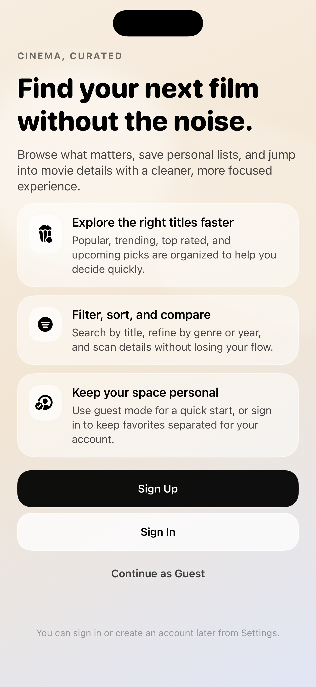
  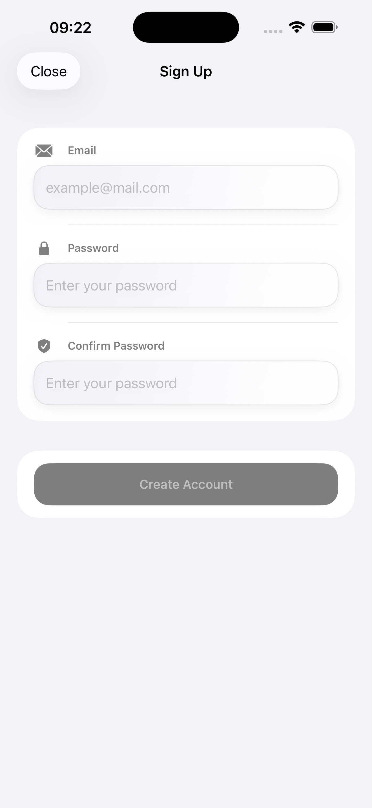
  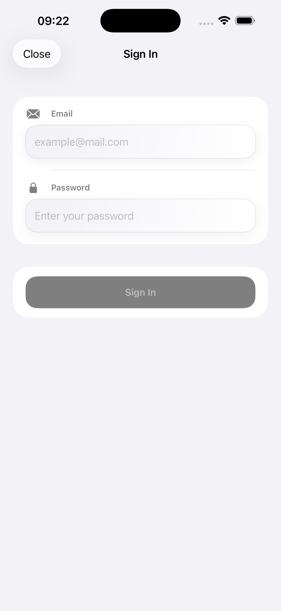
</p>

### Movies
---
Main browsing surface shown in light, dark, and RTL variants.

<p align="center">
  
  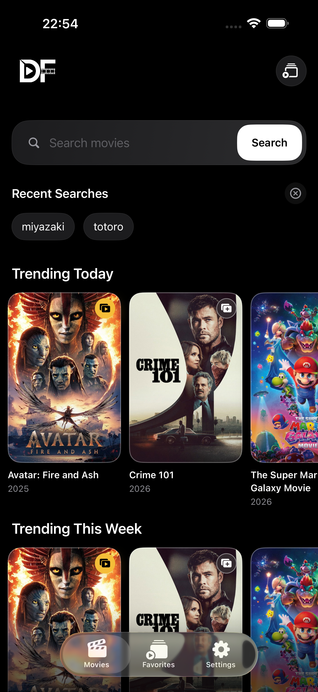
  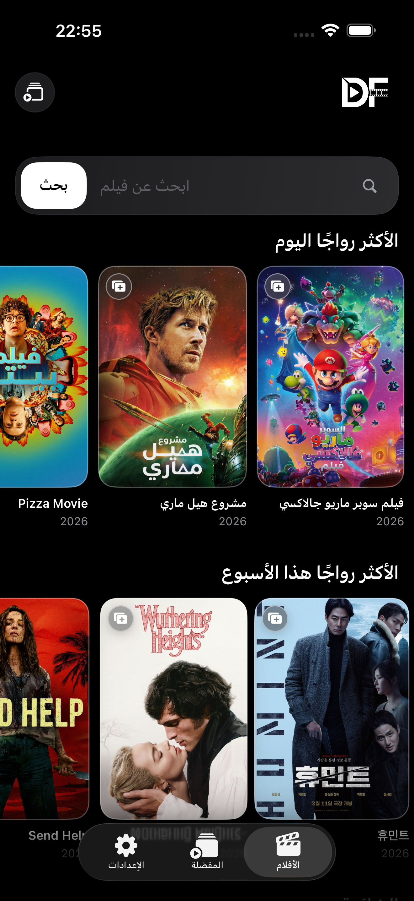
</p>

### Movie Detail
---
Detail presentation across the two primary appearance modes.

<p align="center">
  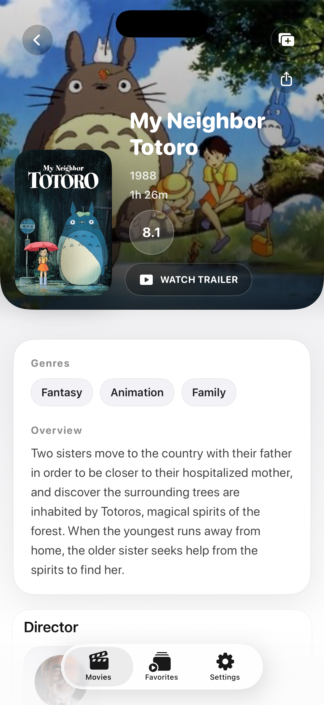
  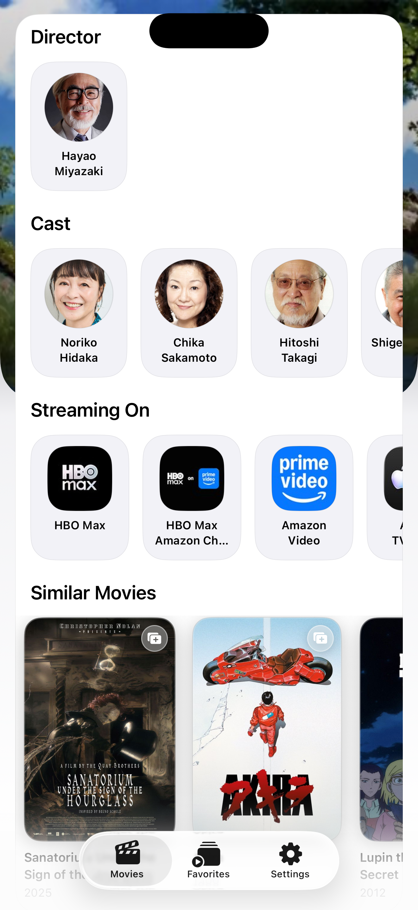
  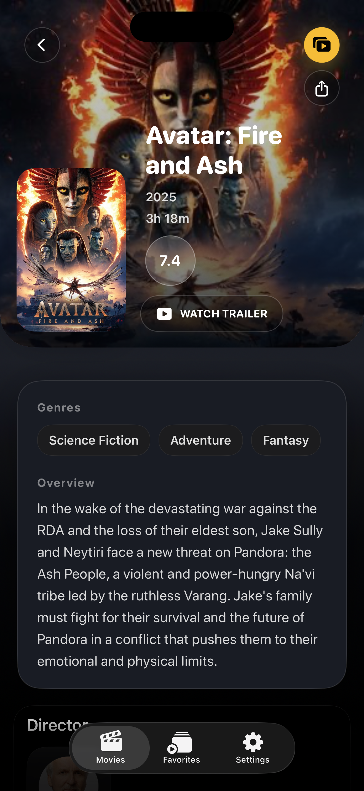
  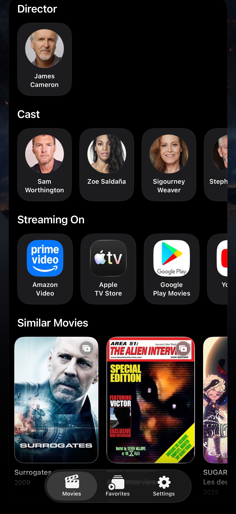
</p>

### Search
---
Search results flow in both light and dark themes.

<p align="center">
  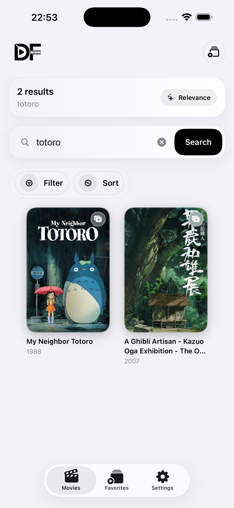
  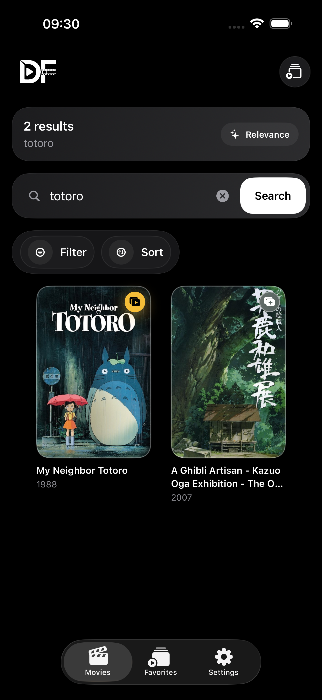
</p>

### Favorites
---
Custom list management surface in light and dark variants.

<p align="center">
  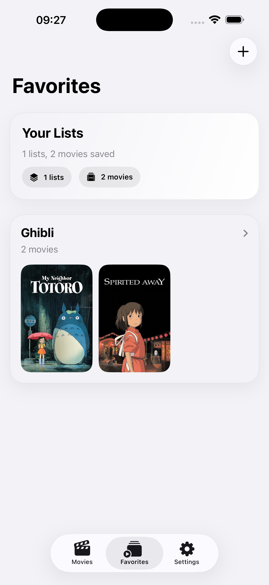
  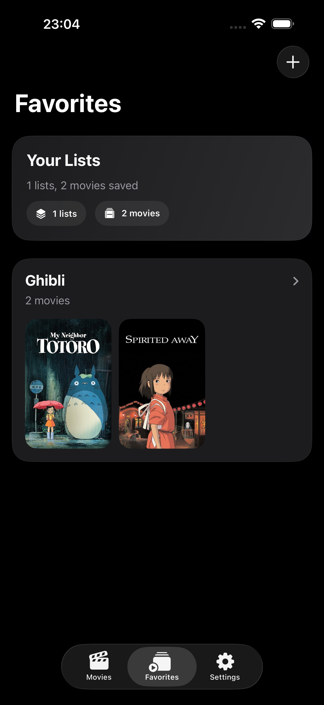
</p>

### Settings
---
Theme, language, and account controls shown across both appearance modes.

<p align="center">
  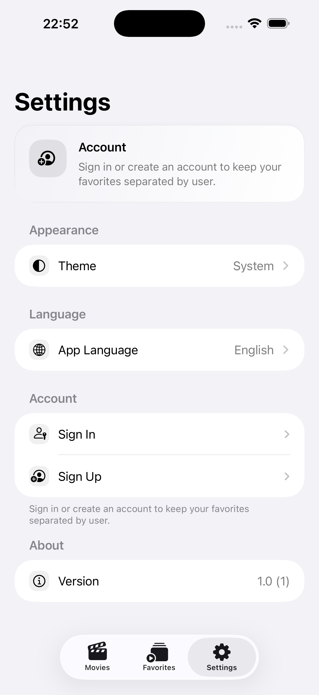
  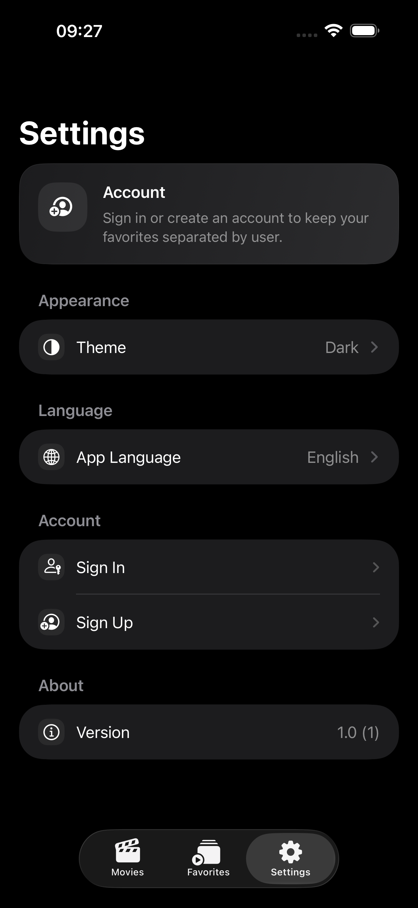
</p>

## Closing Note

The goal with DeFilms was not only to satisfy the checklist, but to make the project feel reviewable, durable, and intentionally built. The strongest parts of the submission are the feature completeness, the navigation/state separation, the localization work, and the attention given to edge cases that usually get skipped in small take-home projects.
